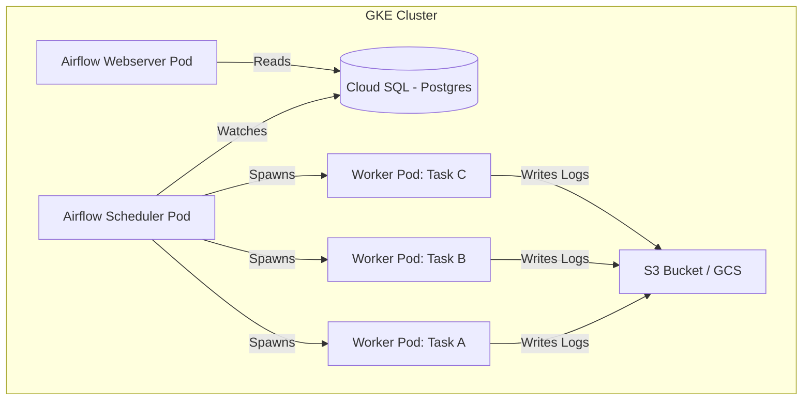

The era of managing data pipelines via `crontab` and shell scripts is effectively over for any team operating at scale. While meaningful utility remains in simple automation, the lack of dependency management, backfilling capabilities, and centralized monitoring makes legacy scheduling untenable for modern data platforms.

This month, we completed the migration of our core ETL workloads to Apache Airflow 1.10 running on Google Kubernetes Engine (GKE). This was not a "lift and shift" operation but a fundamental re-architecture of how we define, schedule, and execute data workflows.

Here is the breakdown of the architecture, the specific configuration choices we made, and the trade-offs involved in adopting the KubernetesExecutor.

## The Problem with the Status Quo

Our legacy environment consisted of a dedicated EC2 instance running hundreds of Python and Bash scripts triggered by `cron`.

This architecture presented three critical failure modes:
1.  **Resource Contention:** A heavy memory-bound job could OOM the entire instance, causing unrelated downstream jobs to fail silently or be delayed.
2.  **Dependency Hell:** Managing conflicting Python library versions across hundreds of scripts on a single host became a Docker-less nightmare of virtual environments and fragile paths.
3.  **Lack of Visibility:** determining the "state" of the platform required SSH-ing into the box and grepping logs. There was no visual representation of the DAG (Directed Acyclic Graph).

## Architecture: Airflow on Kubernetes

We chose to deploy Airflow on Kubernetes using the **KubernetesExecutor**. Unlike the CeleryExecutor, which requires a standing pool of worker nodes (and a message broker like Redis or RabbitMQ), the KubernetesExecutor spins up a new pod for *every single task instance*.

### The Diagram

### Why KubernetesExecutor?

The decision to use KubernetesExecutor was driven by the need for **dependency isolation**.

In a shared worker model (Celery), all tasks must largely share the same set of dependencies installed on the worker image. With KubernetesExecutor, we can define a specific Docker image for individual tasks via the `executor_config` parameter.

This means `DAG_A` can run `pandas==0.24.0` while `DAG_B` runs `pandas==1.0.1` without conflict. Each task runs in its own ephemeral pod, does its work, and terminates.

## Implementation Details & Trade-offs

### 1. Pod Startup Latency
The primary downside of this approach is latency. Spawning a pod takes time - seconds, sometimes significantly more if the node needs to pull a large image or if the cluster needs to autoscale.

For batch ETL jobs running once a day, an extra 30 seconds of overhead is irrelevant. For near-real-time micro-batches running every 5 minutes, this overhead acts as a lower bound on our data freshness. We accepted this trade-off in exchange for isolation stability.

### 2. Log Persistence
Because worker pods are ephemeral, logs are lost the moment the pod dies. We configured Airflow to write logs to remote object storage (GCS in our case). This is non-negotiable. Without remote logging, debugging failed tasks is impossible.

### 3. Git-Sync Pattern
We implemented the "sidecar" pattern for DAG distribution. We use a `git-sync` sidecar container in the Scheduler and Webserver pods that constantly polls our private infrastructure repository.

This decouples the Airflow image release cycle from the DAG development cycle. Data engineers can push code to `master`, and the changes appear in the Airflow UI within ~60 seconds without redeploying the Airflow services.

## Operational Complexity

Moving to Kubernetes introduces a layer of operational complexity that cannot be ignored. We are no longer just managing Python code; we are managing YAML manifests, `kubectl` contexts, and resource quotas.

We specifically ran into issues with **Database Connection Pooling**. The Scheduler opens a connection to the Postgres metadata database. With the KubernetesExecutor, the scheduler can become quite chatty. We had to implement **PgBouncer** as a connection pooler in front of Cloud SQL to prevent the scheduler from exhausting the available connections during high-concurrency periods.

## Closing Thoughts

The migration to Airflow on Kubernetes has stabilized our platform. We have traded the simplicity of `cron` for the rigorous (but complex) guarantees of a container orchestrator.

The ability to define pipelines as code and isolated runtime environments has eliminated the "it works on my machine" class of errors. The cost, however, is a steep learning curve for the team regarding Kubernetes primitives. As we scale through 2020, I expect this investment in infrastructure-as-code to pay dividends.
